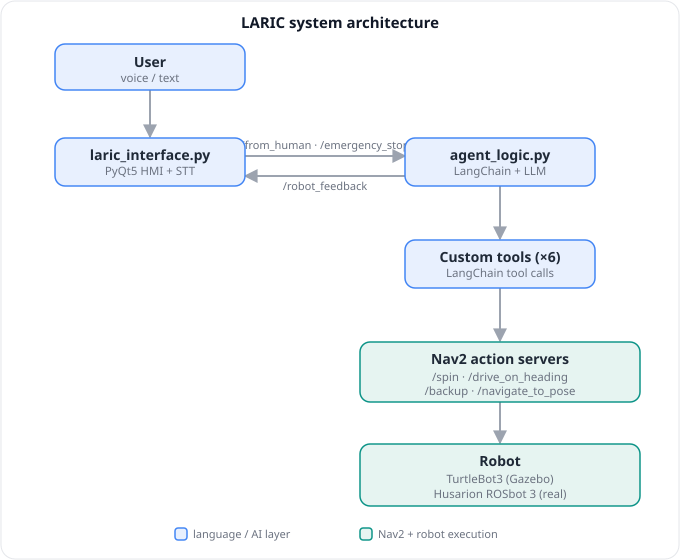

# LARIC — Language-based Agent for Robotic Interaction and Control

> Control a mobile robot using natural language (voice or text) in Spanish or English.  
> Say *"ve al baño"* or *"move forward 1 meter and then turn right 90 degrees"* — no robotics knowledge needed.

**Author:** Lourdes Francés Llimerá · ai2, Universitat Politècnica de València  
**Tutor:** Juan Francisco Blanes Noguera  
**Degree:** Grado en Informática Industrial y Robótica — TFG 2025-2026

---

## What is LARIC?

LARIC is an intelligent robot control system that bridges natural language and ROS 2 robotics. A user speaks or types a command, a large language model (Llama 3.3 70B) interprets the intent and selects the appropriate Nav2 action, and the robot executes it safely with continuous position awareness.

LARIC runs in **two environments from the same codebase**, selected by flags in `config.py`:

- **Simulation** — a TurtleBot3 Waffle Pi in Gazebo (`turtlebot3_house`), on ROS 2 Humble. Nav2 runs on the same machine.
- **Real robot** — a Husarion ROSbot 3 navigating the ai2 laboratory on a static map (`laboratory_map`, built once with SLAM), on ROS 2 Jazzy. The robot's navigation snap and Nav2 run on-board; the laptop is a ROS 2 client.

Switching between them needs no changes to the agent code — only the `is_real_robot` / `is_from_lab` toggles in `config.py` and the matching start script.

---

## Repository Structure

```
LARIC-TFG/
├── README.md
├── docs/                            # Project documentation
|   ├── images/architecture.svg      # System architecture diagram
│   ├── documentacion.pdf            # Full TFG report
│   ├── bibliografia.pdf             # References / bibliography
│   ├── glosario.pdf                 # Technical glossary
│   ├── evolucion_proyecto.pdf       # Project evolution / history
│   ├── manual_comandos.pdf          # Voice/text command reference
│   ├── manual_configuracion.pdf     # Full installation guide (sim + real)
│   └── manual_programacion.pdf      # Code walkthrough
└── laric_ws/
    ├── requirements.txt             # Python dependencies for laric_env
    ├── scripts/
    │   ├── start_simulation.sh      # Launch Gazebo + Nav2 + HMI + Agent (sim)
    │   ├── stop_simulation.sh       # Clean shutdown of the simulation
    │   ├── start_real.sh            # Launch laptop-side HMI + Agent (real robot)
    │   └── stop_real.sh             # Clean shutdown of the laptop-side stack
    ├── locales/                     # gettext catalogs (es/en) + laric.pot
    ├── maps/
    │   ├── tb3_house_map.yaml/.pgm  # Simulation environment map
    │   └── laboratory_map.yaml/.pgm # ai2 lab map (built with SLAM on the ROSbot)
    └── src/
        └── laric_core/
            ├── package.xml
            ├── setup.py / setup.cfg
            ├── config/laric_nav2_params.yaml
            └── laric_core/
                ├── agent_logic.py     # AI agent, tools, ROS 2 control
                ├── laric_interface.py # PyQt5 HMI + Push-to-Talk
                ├── config.py          # Configuration (toggles, API, map, prompt)
                └── i18n.py            # gettext translator (_ / set_language)
```

---

## System Architecture

<p align="center">
  
</p>

**Key ROS 2 topics:**

| Topic | Direction | Purpose |
|---|---|---|
| `/from_human` | HMI → Agent | User command text |
| `/robot_feedback` | Agent → HMI | Status messages |
| `/emergency_stop` | HMI → Agent | Hardware stop signal |
| `/language_changed` | HMI → Agent | Active language code (keeps i18n in sync) |
| `/initialpose` | RViz (sim) / Foxglove (real) → Agent | Localisation initialisation |
| `/cmd_vel` | HMI → Robot | Direct velocity (emergency stop / negation gesture) |

---

## Tech Stack

| Layer | Technology |
|---|---|
| Robot | TurtleBot3 Waffle Pi (Gazebo simulation) · Husarion ROSbot 3 (real) |
| Middleware | ROS 2 Humble (simulation) · ROS 2 Jazzy (real robot) |
| Navigation | Nav2 (Behavior Plugins + NavigateToPose) on a static map — AMCL (sim) · Husarion navigation snap with SLAM off (real) |
| AI Framework | [RAI by Robotec AI](https://github.com/RobotecAI/rai) (modified fork) + LangChain |
| LLM | Llama 3.3 70B via Groq API or local Ollama (ai2 UPV) |
| HMI | PyQt5 + Google Speech Recognition |

---

## Quick Start (simulation)

> **Full installation guide** for both the simulation and the real robot (VMware, Ubuntu, ROS 2, the RAI fork, networking, laric_env): see [`docs/manual_configuracion.pdf`](docs/manual_configuracion.pdf).
>
> ⚠️ **These steps cover the simulation only.** The real robot is a more involved setup (Ubuntu 24.04 / ROS 2 Jazzy, the robot-side navigation snap, a pre-built map). For that, follow [`docs/manual_configuracion.pdf`](docs/manual_configuracion.pdf) rather than the steps below.

### Prerequisites
- Ubuntu 22.04 with ROS 2 Humble installed
- TurtleBot3 packages: `sudo apt install ros-humble-turtlebot3* -y`
- RAI framework installed from the modified fork: [https://github.com/lourdesfll29-maker/rai.git](https://github.com/lourdesfll29-maker/rai.git)
- Python virtual environment `laric_ws/laric_env` with `--system-site-packages`

### 1. Clone the repository
```bash
git clone https://github.com/lourdesfll29-maker/LARIC-TFG.git
cd LARIC-TFG/laric_ws
```

### 2. Set up the Python environment
```bash
python3 -m venv --system-site-packages laric_env
source laric_env/bin/activate
pip install -r requirements.txt
```

### 3. Choose the LLM backend
LARIC selects the LLM with the `is_from_lab` flag in `config.py`:

| Mode | `is_from_lab` | Requires |
|---|---|---|
| Local Ollama (ai2 UPV) | `True` (in-repo default) | University network / VPN |
| Groq cloud API | `False` | `GROQ_API_KEY` environment variable |

For Groq mode:
```bash
export GROQ_API_KEY="gsk_..."
```

### 4. Build the ROS 2 package
```bash
source /opt/ros/humble/setup.bash
source laric_env/bin/activate
colcon build --symlink-install --packages-select laric_core
source install/setup.bash
```

### 5. Launch the system
```bash
./scripts/start_simulation.sh
```

This opens four processes in order: **Gazebo** (10 s) → **Nav2 + RViz** (5 s) → **HMI** (3 s) → **Agent**. Each process logs to `laric_ws/laric_logs/<timestamp>/`, and the HMI window shows live status and any startup errors.

### 6. Initialise robot localisation
Before sending any movement command, set the robot's initial pose on the map. In **simulation** use the **"2D Pose Estimate"** tool in RViz; on the **real robot** publish the pose from the **Foxglove** UI. Both publish to `/initialpose`, and the HMI confirms:
```
[LARIC]: Robot localised. Ready for commands.
```

### 7. Stop the system
```bash
./scripts/stop_simulation.sh
```

### Running on the real robot
The real robot is **not** covered by the quick start above — its setup is more involved. In short: Ubuntu 24.04 / ROS 2 Jazzy, `is_real_robot = True` in `config.py`, and the robot's navigation snap plus Nav2 run on-board the ROSbot (`just start-navigation`, SLAM off, localising against the pre-built `laboratory_map`); the laptop runs only the HMI and agent (`./scripts/start_real.sh`). The full procedure — OS/ROS install, building the map and extracting the waypoints — is in [`docs/manual_configuracion.pdf`](docs/manual_configuracion.pdf).

---

## Available Commands

Full reference: [`docs/manual_comandos.pdf`](docs/manual_comandos.pdf)

| Intent | Example (ES) | Example (EN) |
|---|---|---|
| Rotate | "gira a la derecha 90 grados" | "turn right 90 degrees" |
| Move | "avanza 2 metros" | "move forward 2 meters" |
| Sequence | "avanza 1 metro y luego gira a la derecha" | "move 1m and then turn right" |
| Navigate | "ve al baño" | "go to the bathroom" |
| Stop | "para" / "detente" | "stop" |
| Identity | "¿qué puedes hacer?" | "what can you do?" |

**Known locations (simulation map):** `bathroom`, `dining_room`, `entrance`, `outside`, `top_right_room`, `top_left_room`, `bottom_left_room`, `bottom_right_room`. The real robot uses its own set of lab/corridor waypoints, also defined in `config.py` (`KNOWN_LOCATIONS_REAL`).

### Emergency stop
- **Button** in the HMI interface (always visible)
- **Keyboard shortcut:** `Ctrl+E`

Both bypass the AI agent entirely and halt the robot with minimum latency.

---

## Key Design Decisions

- **All motion through Nav2:** SpinTool uses `/spin`, MoveTool uses `/drive_on_heading` or `/backup`, NavigationTool uses `/navigate_to_pose`. The robot always operates with its position known on the map.
- **Localisation as a hard prerequisite:** All motion tools check `localised_event` before executing. The event is set by a subscriber to `/initialpose`.
- **LangChain one-tool-per-turn solved by SequenceTool:** Multi-step commands are packaged into a single tool call.
- **Two-layer emergency stop:** UI button publishes zero-velocity directly to `/cmd_vel` (immediate), then signals the agent via `/emergency_stop` to cancel Nav2 goals.

---

## Credits

- Map `tb3_house_map` by A. Koubaa — [ros_course_part2](https://github.com/aniskoubaa/ros_course_part2)
- Husarion ROSbot 3 — [husarion.com](https://husarion.com) · [rosbot-autonomy](https://github.com/husarion/rosbot-autonomy)
- RAI Framework by [Robotec AI](https://github.com/RobotecAI/rai)
- Navigation stack: [Nav2](https://github.com/ros-navigation/navigation2)
